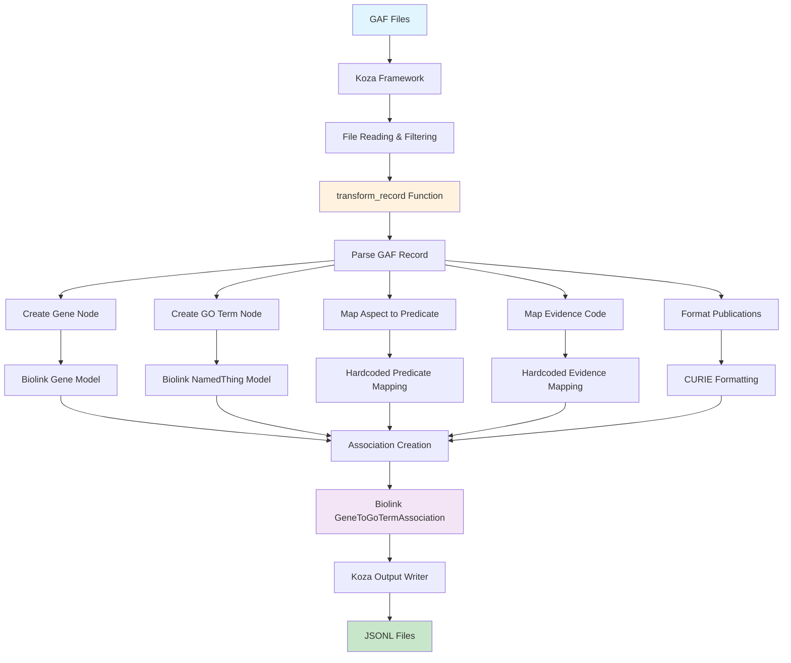

# GOA (Gene Ontology Annotations) Ingest

A **biolink pydantic model-centric** and **koza framework-centered** implementation for transforming Gene Ontology Annotation (GOA) data into biolink-compliant knowledge graph format.

## Best of Breed Implementation

This ingest is a "best of breed" implementation, inspired by and combining ideas from several existing GOA ingest implementations:

- **[Monarch GOA Ingest](https://github.com/monarch-initiative/go-ingest/tree/afc03f3331642d83989f07eef06e1b2c483e7118/src/go_ingest)**: Code structure and logic reference Monarch's annotation ingest patterns
- **[Orion GOA Parser](https://github.com/RobokopU24/ORION/tree/e4d4eb54b4cffb19bd06b0f83558515f752e3b28/parsers/GOA/src)**: Evidence code handling and validation approaches
- **[RTX-KG2 GOA Ingest](https://github.com/RTXteam/RTX-KG2/blob/master/convert/go_gpa_to_kg_jsonl.py)**: Performance optimization and output formatting techniques

This implementation combines the best practices from these sources while adding biolink pydantic model integration and koza framework compatibility for a modern, maintainable, and type-safe approach.

## Overview

This ingest transforms GOA GAF (Gene Association Format) files into biolink-compliant nodes and edges, leveraging the biolink pydantic model for validation and the koza framework for orchestration. The implementation prioritizes **simplicity**, **maintainability**, and **biolink compliance** while maintaining **koza framework compatibility**.

## Key Design Principles

### 1. **Biolink Pydantic Model Centric**
- **Direct Model Usage**: Uses biolink pydantic models (`Gene`, `NamedThing`, `GeneToGoTermAssociation`) directly for validation and structure
- **Type Safety**: Leverages biolink enums (`KnowledgeLevelEnum`, `AgentTypeEnum`) for type safety and validation
- **Automatic Validation**: Pydantic models automatically validate required fields, types, and constraints

### 2. **Koza Framework Centric**
- **Framework Compatibility**: Uses `NamedThing` instead of `OntologyClass` for GO terms due to koza's KGX converter limitations
- **Single Function Approach**: Keeps most logic in `transform_record` for readability and maintainability
- **Koza Orchestration**: Leverages koza for file handling, filtering, and output generation

## Architecture and Flow



## Implementation Details

### 1. **Node Creation**

#### Gene Nodes
```python
# Biolink pydantic model centric: Uses Gene class for automatic validation
gene = Gene(
    id=f"UniProtKB:{db_object_id}",
    name=db_object_symbol,
    category=["biolink:Gene"],
    in_taxon=[taxon.replace("taxon:", "NCBITaxon:")],
)
```

#### GO Term Nodes
```python
# Biolink pydantic model centric: Uses NamedThing due to koza framework compatibility
# While OntologyClass would be semantically more appropriate, koza's KGX converter 
# only supports NamedThing and Association entities for proper serialization
go_term = NamedThing(
    id=go_id,
    category=["biolink:NamedThing"]
)
```

### 2. **Predicate Mapping**

**Rationale**: Biolink pydantic model doesn't expose predicate constants from the YAML slots section, so hardcoded mappings are used.

```python
ASPECT_TO_PREDICATE = {
    "P": "biolink:participates_in",  # Biological Process
    "F": "biolink:enables",          # Molecular Function  
    "C": "biolink:located_in",       # Cellular Component
}
```

### 3. **Evidence Code Mapping**

**Rationale**: Uses hardcoded mapping for simplicity and performance, with biolink enums providing validation.

```python
EVIDENCE_CODE_TO_KNOWLEDGE_LEVEL_AND_AGENT_TYPE = {
    "EXP": (KnowledgeLevelEnum.knowledge_assertion, AgentTypeEnum.manual_agent),
    "IEA": (KnowledgeLevelEnum.prediction, AgentTypeEnum.automated_agent),
    # ... more mappings
}
```

**Key Decisions**:
- **Hardcoded vs. JSON Config**: Chose hardcoded for simplicity and performance
- **Biolink Enums**: Uses `KnowledgeLevelEnum` and `AgentTypeEnum` for type safety
- **Fallback Values**: Unknown codes default to `not_provided`

### 4. **Association Creation**

```python
# Biolink pydantic model centric: Uses association class constructor for validation
association = association_class(
    id=str(uuid.uuid4()),
    subject=gene.id,
    predicate=predicate,
    object=go_term.id,
    negated="NOT" in qualifier,
    has_evidence=[f"ECO:{evidence_code}"],  # Biolink-centric: Formats evidence as ECO CURIE
    publications=publications_list,
    primary_knowledge_source=INFORES_GOA,
    aggregator_knowledge_source=[INFORES_BIOLINK],
    knowledge_level=knowledge_level,
    agent_type=agent_type,
)
```

## Important Design Decisions

### 1. **NamedThing vs. OntologyClass for GO Terms**

**Decision**: Use `NamedThing` instead of `OntologyClass`

**Why**:
- **Koza Framework Limitation**: Koza's KGX converter only supports `NamedThing` and `Association` entities
- **Framework Compatibility**: Ensures proper serialization and output generation
- **Semantic Trade-off**: While `OntologyClass` is semantically more appropriate, framework compatibility takes precedence

### 2. **Hardcoded Evidence Code Mapping**

**Decision**: Use hardcoded mapping instead of JSON configuration

**Why**:
- **Simplicity**: Easier to maintain and understand
- **Performance**: No file I/O overhead
- **Reliability**: No dependency on external configuration files
- **Biolink Integration**: Uses biolink enums for validation

### 3. **Taxon Modeling on Nodes Only**

**Decision**: Set `in_taxon` only on gene nodes, not on associations

**Why**:
- **Biolink Model Constraint**: `GeneToGoTermAssociation` doesn't include the 'thing with taxon' mixin
- **Framework Compliance**: Follows biolink model design principles
- **Inference**: Taxon information can be inferred from subject node's `in_taxon` property

### 4. **Single Function Approach**

**Decision**: Keep most logic in `transform_record` function

**Why**:
- **Readability**: Easier to understand the complete transformation flow
- **Maintainability**: Changes don't require navigating multiple functions
- **Koza Integration**: Aligns with koza's single-function transform pattern

## Usage

### Running the Ingest

```bash
make transform SOURCE_ID=goa
```

This command:
1. Downloads GOA GAF files (if not present)
2. Runs koza transform using `goa.yaml` configuration
3. Outputs biolink-compliant JSONL files to `data/goa/`

### Output Files

- **`goa_nodes.jsonl`**: Contains gene and GO term nodes
- **`goa_edges.jsonl`**: Contains gene-to-GO term associations

### Sample Output

#### Good Examples

**✅ Good Gene Node** (complete with all properties):
```json
{
  "id": "UniProtKB:A0A024RBG1",
  "category": ["biolink:Gene"],
  "name": "NUDT4B",
  "in_taxon": ["NCBITaxon:9606"]
}
```

**✅ Good Association Edge** (with real PMID and manual evidence):
```json
{
  "id": "8bc9cb82-5a5b-43de-b448-0aee89f8c453",
  "subject": "UniProtKB:A0A024RBG1",
  "predicate": "biolink:enables",
  "object": "GO:0005515",
  "negated": false,
  "publications": ["PMID:33961781"],
  "has_evidence": ["ECO:IPI"],
  "primary_knowledge_source": "infores:goa",
  "aggregator_knowledge_source": ["infores:biolink"],
  "knowledge_level": "knowledge_assertion",
  "agent_type": "manual_agent"
}
```

#### Bad Examples

**❌ Bad Gene Node** (missing essential properties):
```json
{
  "id": "GO:0003723",
  "category": ["biolink:NamedThing"]
}
```
*Rationale: GO term nodes lack name and taxon information, making them less useful for downstream analysis.*

**❌ Bad Association Edge** (with GO_REF instead of real PMID):
```json
{
  "id": "489b7cf1-da36-4477-b791-37fc95ad2474",
  "subject": "UniProtKB:A0A024RBG1",
  "predicate": "biolink:enables",
  "object": "GO:0003723",
  "negated": false,
  "publications": ["PMID:GO_REF:0000043"],
  "has_evidence": ["ECO:IEA"],
  "primary_knowledge_source": "infores:goa",
  "aggregator_knowledge_source": ["infores:biolink"],
  "knowledge_level": "prediction",
  "agent_type": "automated_agent"
}
```
*Rationale: GO_REF publications are generic references rather than specific research papers, reducing the quality of evidence.*

## File Structure

```
src/translator_ingest/ingests/goa/
├── goa.py              # Main transform logic (biolink + koza centered)
├── goa.yaml            # Koza configuration
├── download.yaml       # Data source configuration
├── README.md           # This file
└── rig.md              # Reference Ingest Guide
```

## Testing

Run the test suite:
```bash
python -m pytest tests/unit/ingests/goa/test_goa.py -v
```

Tests cover:
- Basic record transformation
- Negation handling
- Different GO aspects
- Evidence code mapping
- Error handling
- Mapping consistency

## Benchmarking

Run the performance benchmark:
```bash
python tests/unit/ingests/goa/benchmark_goa.py
```

The benchmark script measures:
- Processing time and rates
- Memory usage
- File statistics
- Sample data analysis
- Performance metrics

**Requirements**: Install `psutil` for memory monitoring:
```bash
pip install psutil
```

## Performance

### Benchmark Results

**Processing Metrics**:
- **Total Time**: 49.12 seconds
- **Records Processed**: 1,774,969 associations
- **Processing Rate**: 36,135 records/second
- **Memory Usage**: 0.09 MB delta (very memory-efficient)
- **Output Size**: 658.16 MB edges, 9.65 MB nodes

**File Statistics**:
- **Input Files**: 27.71 MB (14.71 MB human + 13.00 MB mouse)
- **Output/Input Ratio**: 23.75x (significant expansion due to JSON formatting)
- **Average Edge Size**: 388.8 bytes per association
- **Average Node Size**: 104.8 bytes per node

### Performance Notes

**Koza Framework Trade-offs**:
- **Row-by-Row Processing**: Koza processes records individually, not in chunks
- **Memory Efficiency**: Very low memory footprint due to streaming approach
- **Speed vs. Memory**: May not be the fastest solution, but prioritizes memory efficiency
- **Framework Choice**: Koza was chosen for its shared interface parser and existing functionality
- **Scalability**: Handles large datasets without memory issues

**Why Koza?**:
- **Shared Interface**: Provides consistent parsing interface across ingests
- **Existing Infrastructure**: Leverages existing koza framework and tooling
- **Memory Friendly**: Doesn't store all data in memory during processing
- **Maintainability**: Standardized approach across the project

For more information about koza, see: [https://github.com/monarch-initiative/koza](https://github.com/monarch-initiative/koza)

## Future Enhancements

1. **Multi-species Support**: Extend to `goa_uniprot_all.gaf.gz`
2. **GPAD Integration**: Add support for detailed qualifiers
3. **GPI Integration**: Enrich gene product metadata
4. **Dynamic Predicates**: If biolink adds predicate registry
5. **Configuration**: Move mappings to external config if complexity increases

## Contributing

When modifying this ingest:
1. Maintain biolink pydantic model centric approach
2. Preserve koza framework compatibility
3. Add clear comments explaining design decisions
4. Update tests for new functionality
5. Update this README for significant changes