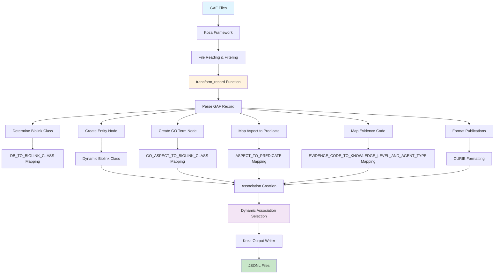

# GOA (Gene Ontology Annotations) Ingest

A **biolink pydantic model-centric** and **koza framework-centered** implementation for transforming Gene Ontology Annotation (GOA) data into biolink-compliant knowledge graph format.

## Overview

This ingest transforms GOA GAF (Gene Association Format) files into biolink-compliant nodes and edges, leveraging the biolink pydantic model for validation and the koza framework for orchestration. The implementation prioritizes **simplicity**, **maintainability**, and **biolink compliance** while maintaining **koza framework compatibility**.

## Best of Breed Implementation

This ingest is a "best of breed" implementation, inspired by and combining ideas from several existing GOA ingest implementations:

- **[Monarch GOA Ingest](https://github.com/monarch-initiative/go-ingest/tree/afc03f3331642d83989f07eef06e1b2c483e7118/src/go_ingest)**
- **[Orion GOA Parser](https://github.com/RobokopU24/ORION/tree/e4d4eb54b4cffb19bd06b0f83558515f752e3b28/parsers/GOA/src)**
- **[RTX-KG2 GOA Ingest](https://github.com/RTXteam/RTX-KG2/blob/master/convert/go_gpa_to_kg_jsonl.py)**

This implementation combines the best practices from these sources while adding biolink pydantic model integration and koza framework compatibility for a modern, maintainable, and type-safe approach.

## Key Design Principles

### 1. **Biolink Pydantic Model Centric**
- **Direct Model Usage**: Uses biolink pydantic models (`Gene`, `Protein`, `NamedThing`, `GeneToGoTermAssociation`, `Association`, `BiologicalProcess`, `MolecularActivity`, `CellularComponent`, `MacromolecularComplex`, `RNAProduct`) directly for validation and structure
- **Type Safety**: Leverages biolink enums (`KnowledgeLevelEnum`, `AgentTypeEnum`) for type safety and validation
- **Automatic Validation**: Pydantic models automatically validate required fields, types, and constraints
- **Dynamic Categories**: Category assignments are fetched directly from biolink pydantic models for consistency

### 2. **Koza Framework Centric**
- **Framework Compatibility**: Uses `NamedThing` instead of `OntologyClass` for GO terms due to koza's KGX converter limitations
- **Transform Record Approach**: Uses `@koza.transform_record()` decorator for record-by-record processing
- **Koza Orchestration**: Leverages koza for file handling, filtering, and output generation

## Architecture and Flow



## Implementation Details

### 1. **Dynamic Category Assignments**

The implementation fetches category assignments directly from biolink pydantic models to ensure consistency:

```python
# Dynamic category assignments from Biolink pydantic models
# This ensures the categories are always in sync with the Biolink model
GENE_CATEGORY = Gene.model_fields['category'].default
PROTEIN_CATEGORY = Protein.model_fields['category'].default
NAMED_THING_CATEGORY = NamedThing.model_fields['category'].default
GENE_TO_GO_TERM_ASSOCIATION_CATEGORY = GeneToGoTermAssociation.model_fields['category'].default
MACROMOLECULAR_COMPLEX_CATEGORY = MacromolecularComplex.model_fields['category'].default
RNA_PRODUCT_CATEGORY = RNAProduct.model_fields['category'].default
```

### 2. **Dynamic Database Source Mapping**

The implementation dynamically selects appropriate biolink classes based on the database source:

```python
# Database to biolink class mapping
# This allows dynamic selection of Gene vs Protein based on the data source
# UniProtKB contains proteins, while other sources like MGI contain genes
DB_TO_BIOLINK_CLASS = {
    "UniProtKB": Protein,           # UniProtKB contains protein sequences
    "MGI": Gene,                    # MGI contains gene information
    "SGD": Gene,                    # SGD contains gene information
    "RGD": Gene,                    # RGD contains gene information
    "ZFIN": Gene,                   # ZFIN contains gene information
    "FB": Gene,                     # FlyBase contains gene information
    "WB": Gene,                     # WormBase contains gene information
    "TAIR": Gene,                   # TAIR contains gene information
    "ComplexPortal": MacromolecularComplex,  # ComplexPortal contains protein complexes
    "RNAcentral": RNAProduct,       # RNAcentral contains RNA products
}
```

### 3. **Dynamic GO Aspect Mapping**

GO aspects are mapped to specific biolink classes for proper semantic categorization:

```python
# GO aspect to biolink class mapping for proper categorization
GO_ASPECT_TO_BIOLINK_CLASS = {
    "P": BiologicalProcess,  # Biological Process
    "F": MolecularActivity,  # Molecular Function  
    "C": CellularComponent,  # Cellular Component
}
```

### 4. **Node Creation**

#### Entity Nodes (Dynamic Class Selection)
```python
# Create entity node using appropriate Biolink class
# Biolink pydantic model centric: Uses appropriate class from biolink model for automatic validation of required fields,
# proper type checking, and biolink-compliant structure
entity = biolink_class(
    id=f"{db_source}:{db_object_id}",
    name=db_object_symbol,
    category=biolink_class.model_fields['category'].default,  # Dynamic category from Biolink model
    in_taxon=[taxon.replace("taxon:", "NCBITaxon:")],  # Convert GO taxon format to Biolink NCBI format
    description=db_object_name if db_object_name else None,  # Include full entity name as description
)
```

#### GO Term Nodes (Dynamic Class Selection)
```python
# Create GO term node using appropriate biolink class based on aspect
# GO aspects map to specific biolink classes for proper semantic categorization:
# P (Process) -> BiologicalProcess, F (Function) -> MolecularActivity, C (Component) -> CellularComponent
go_biolink_class = GO_ASPECT_TO_BIOLINK_CLASS.get(aspect, NamedThing)
go_term = go_biolink_class(
    id=go_id,
    category=go_biolink_class.model_fields['category'].default  # Dynamic category from Biolink model
)
```

### 5. **Predicate Mapping**

**Rationale**: Biolink pydantic model doesn't expose predicate constants from the YAML slots section, so hardcoded mappings are used.

```python
ASPECT_TO_PREDICATE = {
    "P": "biolink:participates_in",  # Biological Process
    "F": "biolink:enables",          # Molecular Function  
    "C": "biolink:located_in",       # Cellular Component
}
```

### 6. **Evidence Code Mapping**

**Rationale**: Uses hardcoded mapping for simplicity and performance, with biolink enums providing validation.

```python
EVIDENCE_CODE_TO_KNOWLEDGE_LEVEL_AND_AGENT_TYPE = {
    "EXP": (KnowledgeLevelEnum.knowledge_assertion, AgentTypeEnum.manual_agent),
    "IEA": (KnowledgeLevelEnum.prediction, AgentTypeEnum.automated_agent),
    # ... more mappings
}
```

**Key Decisions**:
- **Hardcoded vs. JSON Config**: Chose hardcoded for simplicity and performance
- **Biolink Enums**: Uses `KnowledgeLevelEnum` and `AgentTypeEnum` for type safety
- **Fallback Values**: Unknown codes default to `not_provided`

### 7. **Dynamic Association Creation**

```python
# Create association dynamically based on the biolink class
# Biolink pydantic model centric: Uses appropriate association class based on the entity type
# For Gene entities, use GeneToGoTermAssociation; for other entities, use generic Association
# since there are no specific associations for Protein, MacromolecularComplex, or RNAProduct in the biolink model
if biolink_class == Gene:
    # Use GeneToGoTermAssociation for gene entities
    association = GeneToGoTermAssociation(
        id=str(uuid.uuid4()),
        subject=entity.id,
        predicate=predicate,
        object=go_term.id,
        negated="NOT" in qualifier,  # Handle negative associations from GAF qualifier field
        has_evidence=[f"ECO:{evidence_code}"],  # Biolink pydantic model centric: Formats evidence as ECO CURIE
        publications=publications_list,
        primary_knowledge_source=INFORES_GOA,  # GOA as the primary source
        aggregator_knowledge_source=[INFORES_BIOLINK],  # This repository as aggregator
        knowledge_level=knowledge_level,
        agent_type=agent_type,
    )
else:
    # Use generic Association for protein, complex, and RNA entities since there are no specific associations
    association = Association(
        id=str(uuid.uuid4()),
        subject=entity.id,
        predicate=predicate,
        object=go_term.id,
        negated="NOT" in qualifier,  # Handle negative associations from GAF qualifier field
        has_evidence=[f"ECO:{evidence_code}"],  # Biolink pydantic model centric: Formats evidence as ECO CURIE
        publications=publications_list,
        primary_knowledge_source=INFORES_GOA,  # GOA as the primary source
        aggregator_knowledge_source=[INFORES_BIOLINK],  # This repository as aggregator
        knowledge_level=knowledge_level,
        agent_type=agent_type,
    )
```

## Important Design Decisions

### 1. **Dynamic Entity Type Selection**

**Decision**: Use database source to determine appropriate biolink class

**Why**:
- **Semantic Accuracy**: UniProtKB contains proteins, MGI contains genes, etc.
- **Biolink Compliance**: Uses most appropriate biolink class for each entity type
- **Extensibility**: Easy to add new database sources and their corresponding biolink classes

### 2. **Dynamic GO Term Categorization**

**Decision**: Map GO aspects to specific biolink classes

**Why**:
- **Semantic Precision**: BiologicalProcess, MolecularActivity, and CellularComponent are more specific than generic NamedThing
- **Biolink Compliance**: Uses the most appropriate biolink class for each GO aspect
- **Framework Compatibility**: All these classes are compatible with Koza's KGX converter

### 3. **Dynamic Association Selection**

**Decision**: Use GeneToGoTermAssociation for Gene entities, generic Association for others

**Why**:
- **Biolink Compliance**: Uses specific association when available
- **Framework Compatibility**: Falls back to generic Association for entity types without specific associations
- **Extensibility**: Can easily add specific associations for Protein, MacromolecularComplex, etc. when they become available

### 4. **Hardcoded Evidence Code Mapping**

**Decision**: Use hardcoded mapping instead of JSON configuration

**Why**:
- **Simplicity**: Easier to maintain and understand
- **Performance**: No file I/O overhead
- **Reliability**: No dependency on external configuration files
- **Biolink Integration**: Uses biolink enums for validation

### 5. **Taxon Modeling on Nodes Only**

**Decision**: Set `in_taxon` only on entity nodes, not on associations

**Why**:
- **Biolink Model Constraint**: `GeneToGoTermAssociation` doesn't include the 'thing with taxon' mixin
- **Framework Compliance**: Follows biolink model design principles
- **Inference**: Taxon information can be inferred from subject node's `in_taxon` property

### 6. **Koza Transform Record Approach**

**Decision**: Use `@koza.transform_record()` decorator

**Why**:
- **Framework Integration**: Aligns with koza's recommended approach
- **Memory Efficiency**: Processes records one at a time, reducing memory footprint
- **Error Handling**: Better error isolation per record
- **Maintainability**: Clear separation of concerns

## Usage

### Running the Ingest

```bash
make transform SOURCE_ID=goa
```

This command:
1. Downloads GOA GAF files (if not present)
2. Runs koza transform using `goa.yaml` configuration
3. Outputs biolink-compliant JSONL files to `data/goa/`

### Running Benchmarks

```bash
python tests/unit/ingests/goa/benchmark_goa.py
```

This provides detailed performance analysis including:
- Processing time and memory usage
- File statistics and compression ratios
- Sample data quality analysis
- Performance recommendations

### Output Files

- **`goa_nodes.jsonl`**: Contains gene, protein, complex, RNA, and GO term nodes
- **`goa_edges.jsonl`**: Contains gene-to-GO term and other entity-to-GO term associations

### Sample Output

#### Good Examples

**✅ Good Protein Node** (UniProtKB entity):
```json
{
  "id": "UniProtKB:A0A075B6H9",
  "category": ["biolink:Protein"],
  "name": "IGLV4-69",
  "description": "Immunoglobulin lambda variable 4-69",
  "in_taxon": ["NCBITaxon:9606"]
}
```

**✅ Good Gene Node** (MGI entity):
```json
{
  "id": "MGI:1918911",
  "category": ["biolink:Gene"],
  "name": "Gmpr",
  "description": "guanosine monophosphate reductase",
  "in_taxon": ["NCBITaxon:10090"]
}
```

**✅ Good MacromolecularComplex Node** (ComplexPortal entity):
```json
{
  "id": "ComplexPortal:CPX-990",
  "category": ["biolink:MacromolecularComplex"],
  "name": "nua4_mouse",
  "description": "NuA4 histone acetyltransferase complex",
  "in_taxon": ["NCBITaxon:10090"]
}
```

**✅ Good BiologicalProcess Node** (GO term):
```json
{
  "id": "GO:0005634",
  "category": ["biolink:BiologicalProcess"]
}
```

**✅ Good Association Edge** (with real PMID and manual evidence):
```json
{
  "id": "dcb842c6-d91e-43db-b8d5-6d89ee6fb5c3",
  "subject": "UniProtKB:A0A024RBG1",
  "predicate": "biolink:enables",
  "object": "GO:0005515",
  "negated": false,
  "publications": ["PMID:33961781"],
  "has_evidence": ["ECO:IPI"],
  "primary_knowledge_source": "infores:goa",
  "aggregator_knowledge_source": ["infores:biolink"],
  "knowledge_level": "knowledge_assertion",
  "agent_type": "manual_agent"
}
```

#### Bad Examples

**❌ Bad Gene Node** (missing essential properties):
```json
{
  "id": "GO:0003723",
  "category": ["biolink:NamedThing"]
}
```
*Rationale: GO term nodes lack name and taxon information, making them less useful for downstream analysis.*

**❌ Bad Association Edge** (with GO_REF instead of real PMID):
```json
{
  "id": "179b0a8f-d8d2-438b-8b75-d0043da89d9e",
  "subject": "UniProtKB:A0A024RBG1",
  "predicate": "biolink:enables",
  "object": "GO:0003723",
  "negated": false,
  "publications": ["PMID:GO_REF:0000043"],
  "has_evidence": ["ECO:IEA"],
  "primary_knowledge_source": "infores:goa",
  "aggregator_knowledge_source": ["infores:biolink"],
  "knowledge_level": "prediction",
  "agent_type": "automated_agent"
}
```
*Rationale: GO_REF publications are generic references rather than specific research papers, reducing the quality of evidence.*

## File Structure

```
src/translator_ingest/ingests/goa/
├── goa.py              # Main transform logic (biolink + koza centered)
├── goa.yaml            # Koza configuration
├── download.yaml       # Data source configuration
├── README.md           # This file
└── rig.md              # Reference Ingest Guide
```

## Testing

Run the test suite:
```bash
python -m pytest tests/unit/ingests/goa/test_goa.py -v
```

Tests cover:
- Basic record transformation
- Negation handling
- Different GO aspects
- Evidence code mapping
- Error handling
- Mapping consistency

## Performance

### Current Performance Metrics (Latest Benchmark)

**Processing Results**:
- **Total Time**: 47.18 seconds
- **Records Processed**: 1,778,968 associations
- **Processing Rate**: 37,702 records/second
- **Memory Usage**: Very low memory footprint (0.34 MB delta)
- **Output Size**: 659.68 MB edges, 12.96 MB nodes

**File Statistics**:
- **Input Files**: 28.07 MB (human + mouse GAF files)
- **Output/Input Ratio**: 23.50x (significant expansion due to JSON formatting)
- **Nodes Generated**: 92,463 (genes + GO terms)
- **Edges Generated**: 1,778,968 (gene-to-GO associations)
- **Processing Efficiency**: 2,697 records per MB

### Performance Notes

**Koza Framework Benefits**:
- **Memory Efficiency**: Very low memory footprint due to streaming approach
- **Scalability**: Handles large datasets without memory issues
- **Error Isolation**: Individual record processing prevents cascading failures
- **Framework Consistency**: Uses shared koza infrastructure

**Why Koza?**:
- **Shared Interface**: Provides consistent parsing interface across ingests
- **Existing Infrastructure**: Leverages existing koza framework and tooling
- **Memory Friendly**: Doesn't store all data in memory during processing
- **Maintainability**: Standardized approach across the project

For more information about koza, see: [https://github.com/monarch-initiative/koza](https://github.com/monarch-initiative/koza)

## Future Enhancements

1. **Multi-species Support**: Extend to `goa_uniprot_all.gaf.gz`
2. **GPAD Integration**: Add support for detailed qualifiers
3. **GPI Integration**: Enrich gene product metadata
4. **Dynamic Predicates**: If biolink adds predicate registry
5. **Configuration**: Move mappings to external config if complexity increases
6. **Additional Database Sources**: Support for more database sources as they appear in GAF files

## Contributing

When modifying this ingest:
1. Maintain biolink pydantic model centric approach
2. Preserve koza framework compatibility
3. Add clear comments explaining design decisions
4. Update tests for new functionality
5. Update this README for significant changes