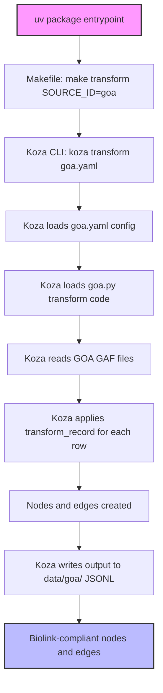

# GOA (Gene Ontology Annotations) Ingest

**note:** this ingest is a "best of breed" implementation, inspired by:
- monarch goa ingest ([monarch-initiative/go-ingest](https://github.com/monarch-initiative/go-ingest/tree/afc03f3331642d83989f07eef06e1b2c483e7118/src/go_ingest))
- orion goa parser ([RobokopU24/ORION](https://github.com/RobokopU24/ORION/tree/e4d4eb54b4cffb19bd06b0f83558515f752e3b28/parsers/GOA/src))
- rtx-kg2 goa ingest ([RTXteam/RTX-KG2](https://github.com/RTXteam/RTX-KG2/blob/master/convert/go_gpa_to_kg_jsonl.py))

this code combines ideas and patterns from these sources, aiming for clarity, maintainability, and biolink/koza best practices.

## key features
- monarch-inspired logic: code structure and logic reference Monarch's annotation ingest patterns
- koza-based: leverages Koza for ingest orchestration and output
- robust biolink compliance: handles evidence codes, qualifiers, and biolink model requirements
- minimal, clear comments: concise, lowercase comments for easy understanding

## workflow overview
1. parse gene and taxon info
2. parse go term and aspect
3. skip irrelevant aspects
4. get eco evidence code
5. fallback for missing evidence
6. determine predicate from aspect/qualifier
7. skip if predicate missing
8. format knowledge source and publications
9. create nodes and association edge
10. collect and output nodes and edges

## pipeline flowchart


## taxon modeling
- currently, `in_taxon` is only set on nodes (e.g., Gene, GeneProduct) because the Biolink model and its Python implementation do not support `in_taxon` on edges/associations
- however, you can still map out taxon context for associations: the subject node of each edge (association) includes its `in_taxon` property, so you can always infer the taxon for any edge by looking up the subject node
- this approach is biolink-compliant and works with all downstream consumers

## usage
run the ingest:
```bash
make transform SOURCE_ID=goa
```
this will:
- download the required GOA GAF files (if not already present)
- run the Koza transform using the current code and YAML config
- output biolink-compliant nodes and edges to `data/goa/`

## output
- nodes: genes (with in_taxon), GO terms
- edges: gene-to-GO term associations (with evidence, publications, etc.)
- in_taxon: only present on nodes, not on edges (see above for rationale)

## code structure
- download.yaml: ingest sources in (gaf.gz format)
- goa.py: main ingest logic, with minimal comments and monarch-inspired structure
- goa.yaml: Koza configuration for file locations, columns, and output properties
- README.md: this file
- rig.md: Reference Ingest Guide for GOA